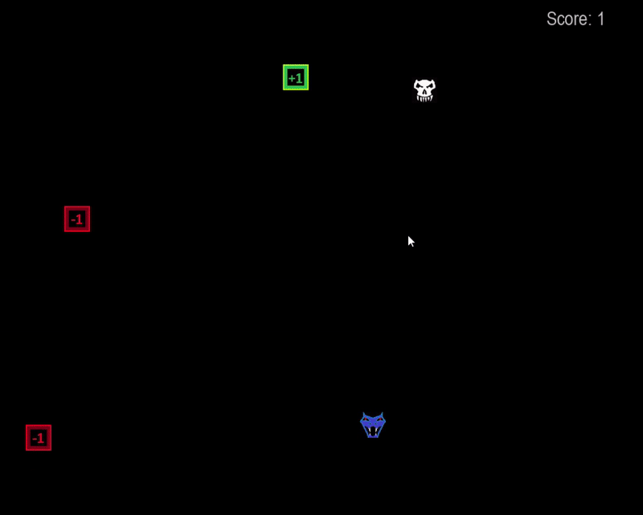

# Snake Game with Pygame
This is a classic Snake game implemented in Python using the Pygame library.

## Game Overview
The Snake game is a simple arcade game where the player controls a snake to eat apples and increase its length. The game ends when the snake collides with the boundaries or itself. Additionally, the snake has to avoid skulls and birds that appear on the screen.

## Requirements
Python 3.x
Pygame library (pip install pygame)

## How to Run
Make sure you have Python and Pygame installed on your system.
Clone this repository to your local machine or download the ZIP.
Navigate to the project folder containing the main.py file.
Run the game by executing the following command:
python main.py

## How to Play
Use the arrow keys (left, right, up, down) to control the movement of the snake.
The snake will grow in length by eating apples and decrease by colliding with skulls.
Avoid collisions with the snake's body, boundaries, skulls, and birds.

## Game Controls
Left Arrow: Move the snake left.
Right Arrow: Move the snake right.
Up Arrow: Move the snake up.
Down Arrow: Move the snake down.
Escape: Exit the game.
Enter: Restart the game after Game Over.

## Screenshots

## Acknowledgments
The Snake Game is a classic arcade game concept.
Pygame library for graphics and game development in Python.

## License
Mit License

## Author
sh4dowpunk
