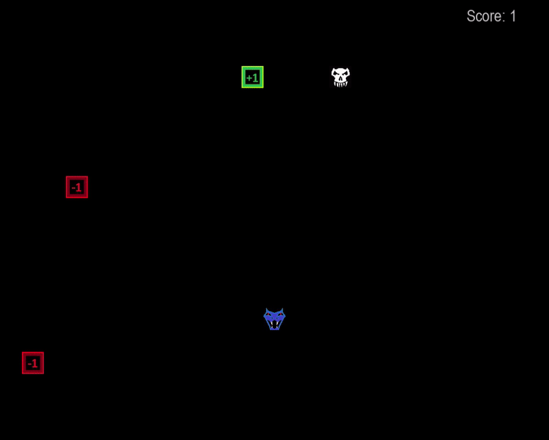

# Snake Game

This is a classic Snake game implemented in Python using the Pygame library.

## Requirements
Python 3.x
Pygame library (pip install pygame)

## How to Run
Make sure you have Python and Pygame installed on your system.
Clone this repository to your local machine or download the ZIP.
Navigate to the project folder containing the main.py file.
Run the game by executing the following command:
python main.py

## Game Controls
* Left Arrow: Move the snake left.
* Right Arrow: Move the snake right.
* Up Arrow: Move the snake up.
* Down Arrow: Move the snake down.
* Escape: Exit the game.
* Enter: Restart the game after Game Over.

## Preview

## License:

This project is licensed under the [MIT License](LICENSE).

---
Feel free to contribute to this project. If you encounter any issues or have suggestions, please create an issue or a pull request.

## Author
sh4dowpunk
